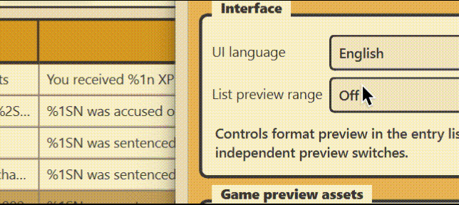
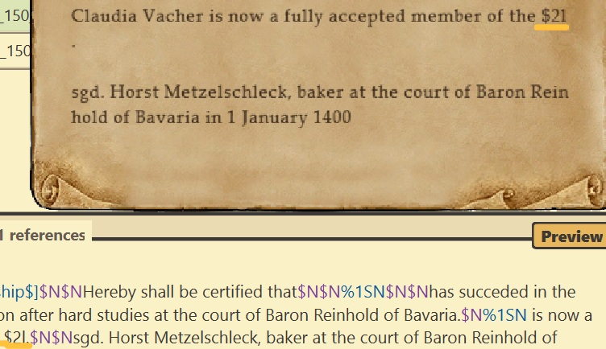
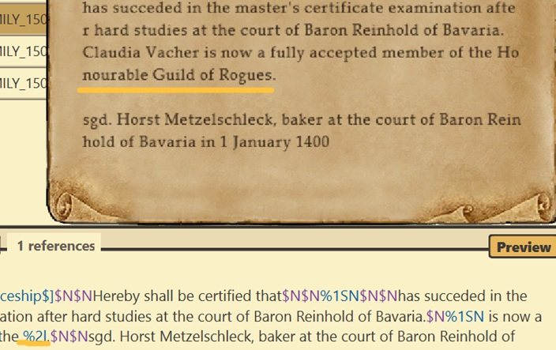
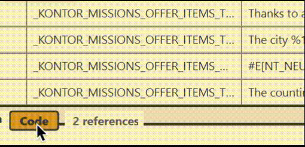
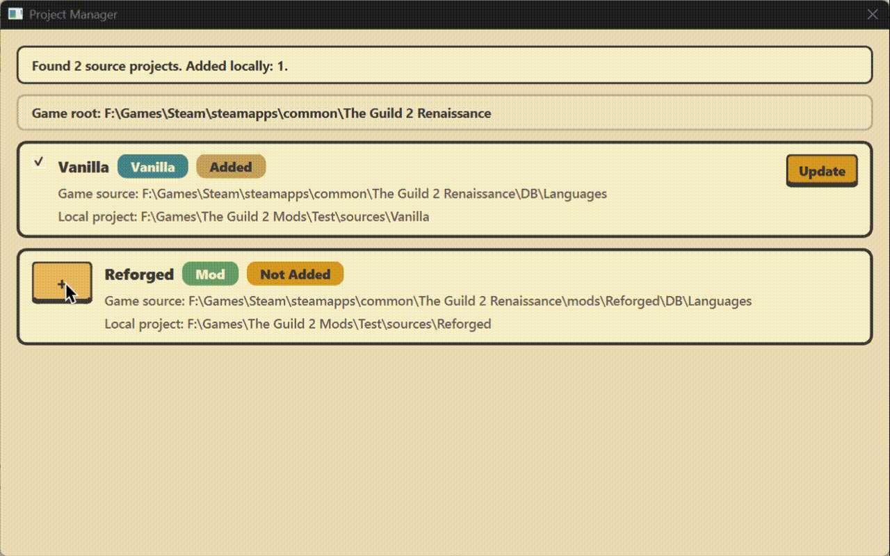
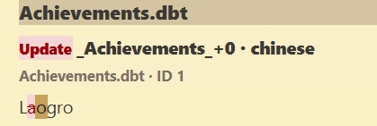

# The Guild 2 Translator

[English](README.md)

The Guild 2 4.6+ 本地化项目编辑器。

## 启动

双击：

```text
run_translator_tool.bat
```

或运行：

```powershell
py -3.12 -m translator_tool.app
```

## 基本使用

1. 点击左上角项目按钮，选择游戏目录或 `sources/` 下的本地项目。
2. 选择语言；需要新语言时，从语言下拉框中创建。
3. 在文件列表中选择要翻译的 `.dbt` 或 `Guides/*.txt`。
4. 在条目列表中选择文本，在右侧输入框编辑译文。
5. 使用搜索和状态筛选定位未译、已改、待检查或无需翻译的条目。
6. 点击保存，译文会写入当前项目和当前语言目录。

## 预览

<p align="center">
  
</p>

- 在设置中选择条目列表的预览范围：关闭、原文、译文或全部。
- 原文和译文输入框各有独立的预览开关。
- 将鼠标悬停在预览按钮上，可以查看接近游戏窗口效果的预览。
- 占位符、颜色、换行、图标和部分游戏字体会按当前资源设置显示。

游戏内预览能更容易发现原文或译文中的格式问题。

<p align="center">
  
  
</p>

## 代码引用

<p align="center">
  
</p>

- 原文标题旁的 `Code` 按钮显示当前条目的代码引用数量。
- 点击按钮打开引用位置；多条引用时按住按钮可选择目标文件。
- 代码引用分析可在设置中关闭。

## 项目管理

<p align="center">
  
</p>

- 从游戏目录扫描原版和 mod 本地化文件。
- 将原版或 mod 添加为本地项目。
- 更新项目时保留当前语言的翻译进度。

## 常用操作

- 右键条目可复制译文、还原译文、清空译文、标记删除或标记无需翻译。
- 右键条目可调用 AI 翻译或 LLM 建议；接口信息在设置中填写。
- 更新日志会按当前项目和当前语言显示翻译改动。

## 更新日志

<p align="center">
  
</p>

- 查看当前项目和当前语言的翻译改动。
- 可选择一个或多个提交查看变更内容。
- 按文件和条目展示新增、删除和修改。

## 项目目录

```text
sources/
|-- Vanilla/
|   `-- languages/
|       |-- *.dbt
|       |-- Guides/
|       `-- #<language-code>/
`-- <项目名>/
    `-- languages/
```
